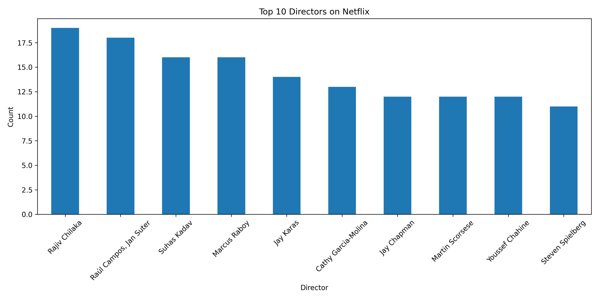

# 🎬 Netflix Data Analysis

An exploratory data analysis (EDA) project on Netflix's content library to uncover trends, patterns, and insights using Python.

---

## 📌 Objective

To analyze Netflix's dataset and answer key business questions such as:
- What type of content dominates Netflix — Movies or TV Shows?
- Which genres are most popular?
- How has content grown over the years?
- Which countries produce the most Netflix content?
- What are the most common content ratings?

---

## 🗂️ Dataset

- **Source:** [Netflix Movies and TV Shows - Kaggle](https://www.kaggle.com/datasets/shivamb/netflix-shows)
- **Records:** 8,800+ titles
- **Features:** Title, Type, Director, Cast, Country, Release Year, Rating, Duration, Genre

---

## 🛠️ Tools & Technologies

| Tool | Purpose |
|---|---|
| Python | Core programming language |
| Pandas | Data cleaning & manipulation |
| Matplotlib | Data visualization |
| Seaborn | Advanced visualizations |
| Google Colab | Development environment |

---

## 📊 Key Insights

- 🎥 **Movies** make up ~70% of Netflix content vs 30% TV Shows
- 📅 Content additions peaked between **2018–2020**
- 🌍 **USA, India & UK** are the top content-producing countries
- 🎭 **Drama, Comedy & Action** are the most popular genres
- 🔞 **TV-MA** is the most common content rating on Netflix

---
## Movies vs TV Shows

.png)

## Top Countries

.png)

## Release Trend

.png)

## Ratings Analysis

.png)

## Top Genres

.png)   

## Top Directors



## 📁 Project Structure

```
netflix-data-analysis/
│
├── data/
│   └── netflix_titles.csv       # Raw dataset
│
├── notebooks/
│   └── netflix_analysis.ipynb   # Main analysis notebook
│
├── images/
│   └── charts/                  # Visualizations
│
├── requirements.txt             # Dependencies
└── README.md
```

---

## 🚀 How to Run

1. Clone the repository:
```bash
git clone https://github.com/navya-347/netflix-data-analysis.git
```

2. Install dependencies:
```bash
pip install -r requirements.txt
```

3. Open the notebook in Google Colab or Jupyter and run all cells.

---

## 📫 Connect With Me

[](https://www.linkedin.com/in/navya-nikhitha-naguru-a0140123a)
[](https://www.kaggle.com/nagurunavyanikhitha)

---

⭐ If you found this project helpful, give it a star!
